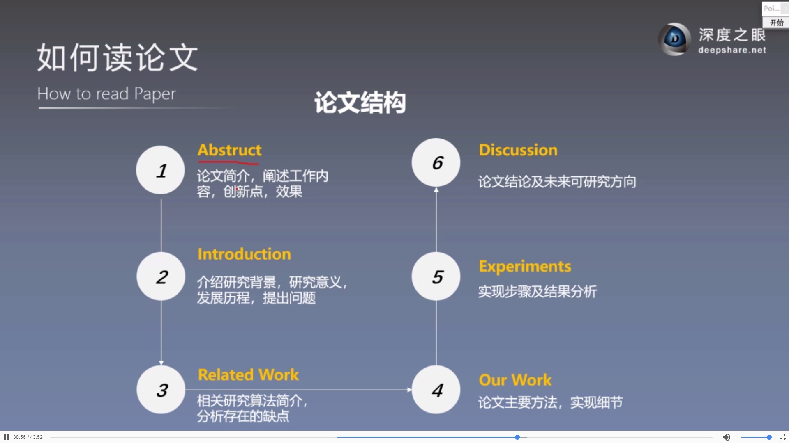
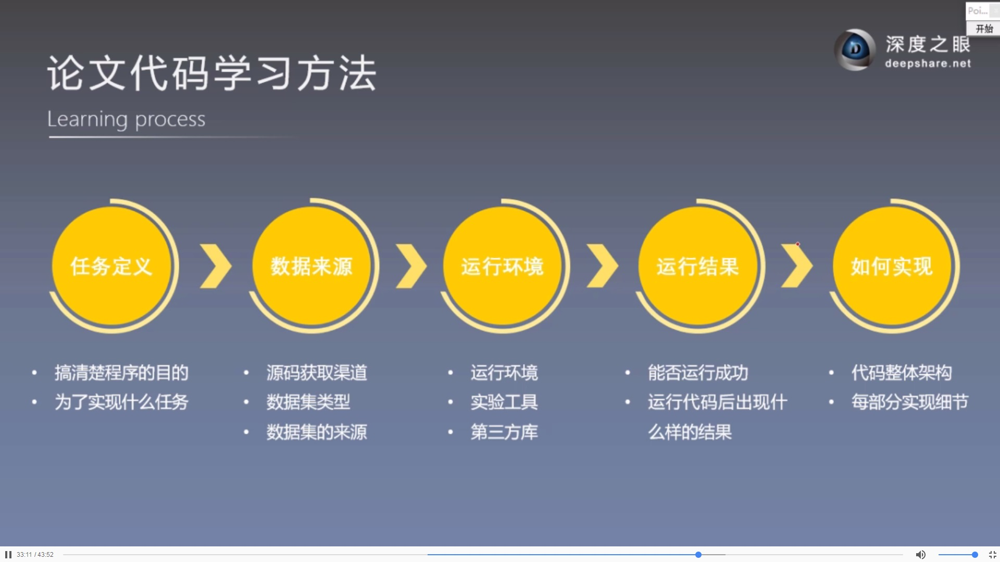
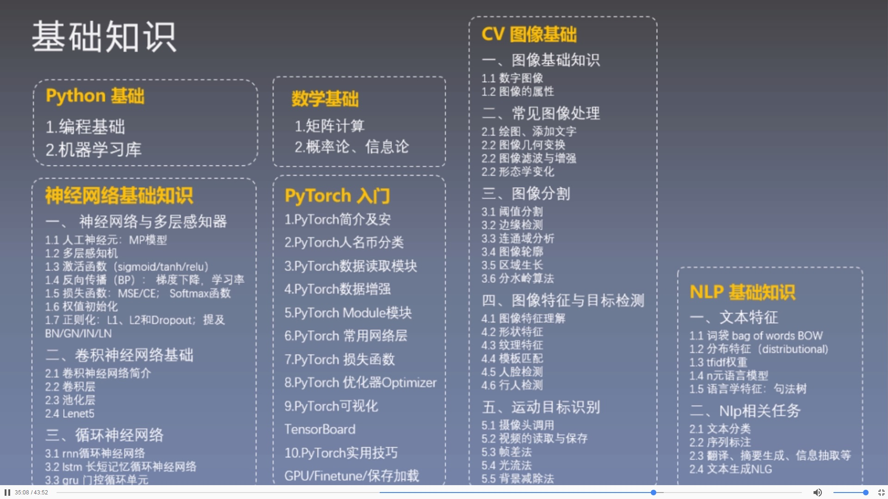
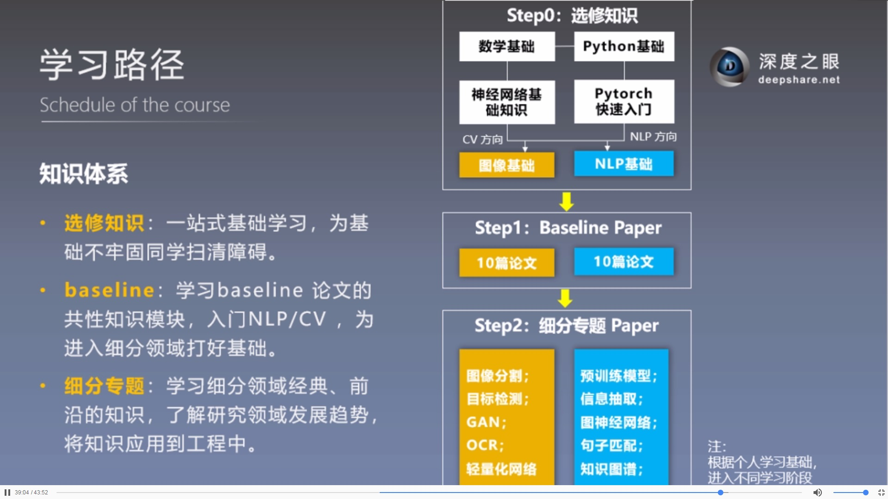
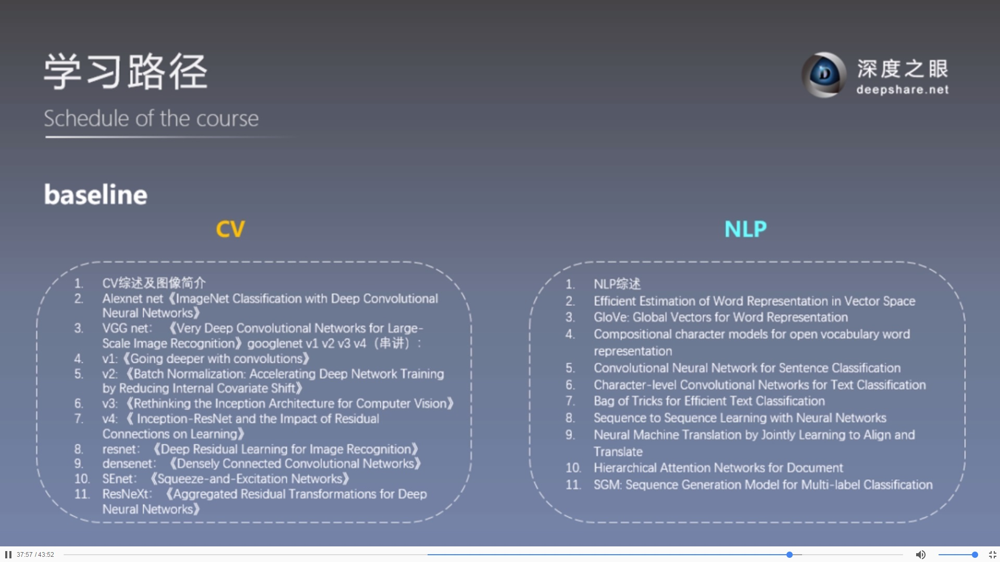
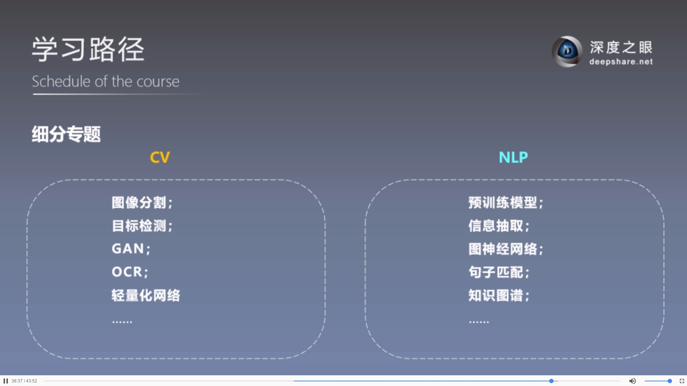

# 1.论文分类

## 按类别分：

1.**综述论文**：快速熟悉某领域现状及子方向，了解基础概念，适合入门；

2.**专题论文**：介绍具体算法，设计思路，实验技巧，代码实现等具体技术；

进入一个新领域，先阅读综述论文，再读专题论文；


## 从论文质量角度：

**高质量期刊会议**：CVPR,ECCV,ICCV,AAAI,NIPS,ICLR,ICML等；

**高引论文**：同行间普遍认可，参考，借鉴的论文；

**知名团队**：YoshuaBengio,YannLeCun，Geoffrey Hinto, Andrew Ng等；

**有代码复现论文**："Talk is cheap, Show me the code."

一个有代码复现的论文网站：
https://www.paperswithcode.com/


# 2.如何找论文：

1.知网：寻找优秀综述论文，快速入门；

2.百度学术，google scholar

3.arXiv:论文预印本

https://arxiv.org/

4.顶会：CVPR, ECCV,ICCV,AAAI,NIPS,ICLR,ICML

观察一篇论文是否优质：

IF(IMPACT fACTOR,影响因子)

JCR(Journal Citation Reports）

SCI期刊分区：

JCR方式（国际通用）：一、二、三、四区各占25%；

中科院（国内）：一区(5%),二区(5%~20%)，三区(20%~50%)，四区(50%);

5.sci-hub:**一个能绕过科研论文收费的神奇网站**

https://sci-hub.tw

https://sci-hub.si

https://sci-hub.se

PMID:PubMed唯一标识码

DOI：数字对象唯一标识吗

百度学术 文献互助： http://xueshu.baidu.com

# 3.整理论文：

时间-作者-题名   时间-关键字-题名

paper不多时可以这样整理，数量太大时，用软件管理


# 4.如何读论文

读论文常遇到的问题：重点，关键点难把握；论文关系复杂；公式图标难懂；难以坚持；借鉴算法为主，注重算法实现；

## 读论文三部曲：泛读、精度、总结

### 4.1泛读：快速浏览，把握概要

读标题，摘要，结论，所有小标题和图表

泛读目标：

1.论文要解决什么问题？

2.论文采用了什么方法？

3.论文达到了什么效果？

### 4.2精度：选出精华，仔细阅读

精度目标及效果自测：所读段落是否详细掌握

### 4.3总结

总结文中创新点，关键点，启发点等重要信息。

论文阅读效果自测

回答三个终极问题

你是谁:论文提出/采用什么方法，细节是什么

从哪里来：论文要解决什么问题/任务，其启发点或借鉴之处在哪

到哪里去：论文方法达到什么效果

论文中可借鉴地方总结：

# 5.论文结构


论文代码学习



# 6.学习途径



## 知识体系



## baseline内容


## 细分专题内容




```python

```


```python

```
